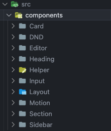
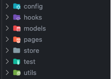

  

   <a href="#reminded">About</a>
    ｜
   <a href="#demo">Demo</a>
  

  

  

# Reminded

[Reminded](https://reminded.web.app) is productivity tool that comes with an idea-action-todo workflow. Add todo and ideas via input modal with shortcut seamlessly. Designed for the users seeking seamless idea transformation into actionable tasks, empowering efficient life management.

### Product Concept

We usually records lots of ideas on the daily basis, but don't know how to manage them or classify them.

#### What is idea in Reminded?

Reminded doesn't let you classify everything at the beginning. On the contrary, Reminded let you record every idea at the first time, but allow you to transform to actionable task later.

#### What is action in Reminded?

The definition in Reminded is to let you transform rough idea to actionable and clear task. For example, _research for TypeScript_ or _have a great travel plan_ is rough. Instead, action should be _Read TypeScript official document of the beginner part_ and _List all of the desire destination for travel_.

#### What is the next?

After setting action with due date, actions will transform to todo cards. During daily work, we receive more and more ideas from every day continuously. Eventually, it would be a infinite loop for Reminded flow.

---

## About Reminded's Tech Stack

### Language

### Library

    

`Driver.js` `Framer Motion`

### Tools and Services

   

### Details

- Implemented centralized global **state management** and data transformation using `MobX`.
- Enhanced UX by implementing **drag-and-drop** functionality using `dnd kit` for seamless card swapping.
- Elevated card manipulation experience with `Framer Motion` for better UX.
- Integrated **debounce** mechanism to reduce request frequency.
- Optimized code structure using **Strategy pattern** and **Dependency Injection**.
- Created responsive layouts with `Tailwind` and `NextUI`, ensuring rapid development.
- Incorporated tag input using `react-mentions`, enabling rapid addition of tags by typing ‘#'.
- Built tutorial UI flow with `driver.js` for improved user guidance.
- Implemented `Firebase Authentication` and `Cookies` for secure login with a 30-day expiration.

### Page Structure

After login, there are 6 main pages in the side bar. Each page has different variants inside each router.

### Components' Structure

- **Card** | idea/action/todo card and toolbar
- **DND** | Drag-and-Drop with
- **Editor** | Note editor and its modal
- **Heading** | Title banner of each page
- **Helper** | Tutorials components
- **Input** | Shared Input in quick input modal and input in each page
- **Layout** | All routers' page layout with Outlet
- **Motion** | Compound Component of Framer Motion
- **Section** | Each Section in the each page, including idea, action, todo, note, today, and its scroll shadow
- **Sidebar** | Shared sidebar and subside bar in idea/action/todo

### Other folders

- **config** | firebase config
- **models** | All class constructors
- **pages** | Each page displayed in different routers
- **store** | all stores of MobX
- **test** | unit test related to rapid addition of tags
- **utils** | all util functions in this folder

---

## Demo

### Login with test account

###### Login [Reminded](https://reminded.web.app) **test account** by clicking the button `測試帳號`.

### Product Tutorial

###### Understand the operation of Reminded.

### Add Idea / Todo

###### Add ideas or todo with tags instantly with input modal by typing "N".

### Drag and Drop

###### Organize your idea / action / todo with drag and drop easily.

### Transform Action

###### Transform idea card to actionable task.

### Transform Todo

###### Transform action card to todo with drag-and-drop or setting date with picker.

### Note Editor

###### Record the note and idea more comprehensively.

### Search Idea / Action / Notes

###### Search all the idea with fuzzy keywords

---
